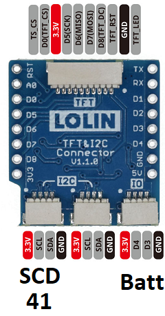

# Twutility/Twomes CO₂ and Bluetooth occupancy monitoring firmware
This repository contains the firmware and pointers to binary releases for the CO₂ monitor. 

It was started under the Twomes project for use in residential buildings. Currently, it is being extended to use as an CO₂ monitor and Bluetooth occupancy detection system for utility buildings.

This repository contains the firmware and binary releases for two variants of CO₂ monitors for the Twomes project, which differ only in the way they their send their data via the [Twomes API](https://github.com/energietransitie/twomes-backoffice-api) to a [Twomes server](https://github.com/energietransitie/twomes-backoffice-server), either directly or indirectly:
* a full-blown Twomes CO₂ measurement device that sends measurement data directly;
* ~~a satellite Twomes CO₂ measurement device that sends its data indirectly, via a [Twomes P1-gateway](https://github.com/energietransitie/twomes-p1-port-logger-gateway);~~ (deprecated; see [Twomes Room Monitor Module firmware](https://github.com/energietransitie/twomes-room-monitor-firmware))
 

## Table of contents
* [General info](#general-info)
* [Deploying](#deploying)
* [Developing](#developing) 
* [Features](#features)
* [Status](#status)
* [License](#license)
* [Credits](#credits)

## General info
The Twomes CO₂ Monitor sends the following properties via the [Twomes API](https://github.com/energietransitie/twomes-backoffice-api) to a Twomes server:

| Sensor | Property           | Unit | [Printf format](https://en.wikipedia.org/wiki/Printf_format_string) | Measurement interval \[h:mm:ss\] | Description                            |
|--------|--------------------|------|--------|-------------------|----------------------------------------|
| SCD41  | `CO2concentration` | ppm  | %d     | 0:05:00           | CO₂ concentration                      |
| SCD41  | `%RH`              | %RH  | %d     | 0:05:00           | relative humidity                      |
| SCD41  | `roomTemp`         | °C   |        | 0:05:00           | air temperature                        |

This data can be analyzed to determine changes in the ventilation ratio of a room, which enables research into the accuracy of learning the thermal characteristics of residential buildings via a dynamic heat balance model.

## Deploying
This section describes how you can deploy binary releases of the firmware, i.e. without changing the source code, without a development environment and without needing to compile the source code.
### Prerequisites
In addition to the [prerequisites described in the generic firmware for Twomes measurement devices](https://github.com/energietransitie/twomes-generic-esp-firmware#prerequisites), you need:
* a WeMos D1 Mini board with ESP32, such as the [LilyGO TTGO T7 Mini32 V1.3 ESP32](https://github.com/LilyGO/ESP32-MINI-32-V1.3)
* powered by either:
  * a 5V power adapter via the micro-USB connector;
  * a LiPo battery;
* a WeMos D1 Mini Shield; either:
  * a [Twomes CO₂ Monitor Shield](https://github.com/energietransitie/twomes-co2-monitor-hardware), or
  * a [Wemos TFT and I2C Connector Shield for D1 Mini connector shield](https://www.tinytronics.nl/shop/en/platforms/wemos-lolin/shields/wemos-tft-and-i2c-connector-shield-for-d1-mini) connected to an [SEK-SCD41](https://www.sensirion.com/en/environmental-sensors/evaluation-kit-sek-environmental-sensing/evaluation-kit-sek-scd41/) evaluation kit, wired up according to to the connection diagram below (connecting battery and TFT e-Ink display is optional).

### Erasing all persistenly stored data
See [Deploying section of the generic firmware for Twomes measurement devices](https://github.com/energietransitie/twomes-generic-esp-firmware#deploying).

### Device preparation
See [Deploying section of the generic firmware for Twomes measurement devices](https://github.com/energietransitie/twomes-generic-esp-firmware#deploying).
The firmware needed can be found as a [release from this repository](https://github.com/energietransitie/twomes-co_2-sensor/releases).

### Erasing only Wi-Fi provisioning data
See [Deploying section of the generic firmware for Twomes measurement devices](https://github.com/energietransitie/twomes-generic-esp-firmware#deploying).

## Developing
This section describes how you can change the source code using a development environment and compile the source code into a binary release of the firmware that can be depoyed, either via the development environment, or via the method described in the section Deploying.

Please see the [developing section of the generic Twomes firmware](https://github.com/energietransitie/twomes-generic-esp-firmware#developing).

## Features
List of features ready and TODOs for future development (other than the [features of the generic Twomes firmware](https://github.com/energietransitie/twomes-generic-esp-firmware#features)). 

Ready:
* Measure properties according to the measurement table above. 
* Send the data collected to a Twomes server.

To-do:
* Use the most recent version of the [Twomes Generic firmware](https://github.com/energietransitie/twomes-generic-esp-firmware) and parts of the [Twomes Room Monitor Module firmware](https://github.com/energietransitie/twomes-room-monitor-firmware).
* Remove ESP-NOW code (deprecated; this function moved to [Twomes Room Monitor Module firmware](https://github.com/energietransitie/twomes-room-monitor-firmware).
* Add support for reading temperature value from a Si7051 as property `roomTemp` and rename the SCD41 temperature measurement `roomTempCO2`.
* Report measurement values for temperature and relative humidity as proper float values.
* Reset Wi-Fi provisioning by a long press (>10s) on a button. 
* Align indication of status and error via LEDs with other measurement devices.
* Update installation manual and device photo.

## Status
Project is: _in progress_

## License
This software is available under the [Apache 2.0 license](./LICENSE), Copyright 2021 [Research group Energy Transition, Windesheim University of Applied Sciences](https://windesheim.nl/energietransitie) 

## Credits
This software is a collaborative effort of:
* Maarten Vermeulen · [@m44rtn](https://github.com/m44rtn)
* Tristan Jongedijk · [@tristanjongedijk](https://github.com/tristanjongedijk)
* Laurens de Boer · [@Laurenz02](https://github.com/Laurenz02)

Product owners:
* Marco Winkelman · [@MarcoW71](https://github.com/MarcoW71)
* Henri ter Hofte · [@henriterhofte](https://github.com/henriterhofte) · Twitter [@HeNRGi](https://twitter.com/HeNRGi)

We use and gratefully acknowlegde the efforts of the makers of the following source code and libraries:
* [ESP-IDF](https://github.com/espressif/esp-idf), by Espressif Systems, licensed under [Apache License 2.0](https://github.com/espressif/esp-idf/blob/9d34a1cd42f6f63b3c699c3fe8ec7216dd56f36a/LICENSE)
* [Twomes Generic ESP Firmware](https://github.com/energietransitie/twomes-generic-esp-firmware), by Research group Energy Transition, Windesheim University of Applied Sciences, licensed under [Apache License 2.0](https://github.com/energietransitie/twomes-generic-esp-firmware/blob/b17f346d78ac7dde6f2dff6b5e7639e98d55c348/LICENSE.md)
