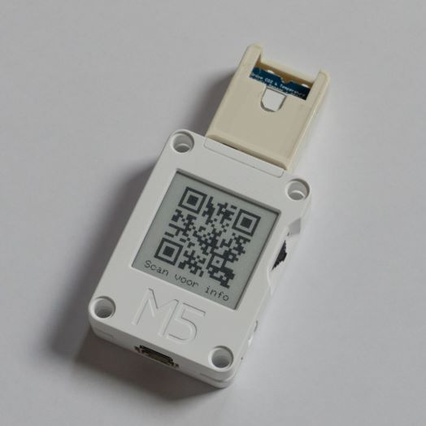

# Twomes CO₂ and bluetooth occupancy firmware for the M5CoreInk and SCD41
This repository contains source code and binary releases for firmware for an M5Stack CoreInk device that measures CO₂ concentration, temperature and relative humidity via a connected Sensirion SCD41 sensor and occupancy (i.e. the number of smartphones of participating subjects) via Bluetooth name requests.

## Table of contents
* [General info](#general-info)
* [Measurements](#measurements)
* [Deploying](#deploying)
* [Developing](#developing)
* [Required hardware](#required-hardware) 
* [Supported devices](#supported-devices)
* [Features](#features)
* [Status](#status)
* [License](#license)
* [Credits](#credits)

## General info
This measurement device is a combination of two devices that were developed in the Twomes project:
- [twomes-temp-monitor-hardware](https://github.com/energietransitie/twomes-temp-monitor-hardware) with [twomes-co2-monitor-hardware](https://github.com/energietransitie/twomes-co2-monitor-hardware) running  [twomes-room-monitor-firmware](https://github.com/energietransitie/twomes-room-monitor-firmware);
* [twomes-opentherm-monitor-firmware](https://github.com/energietransitie/twomes-opentherm-monitor-firmware) running [twomes-opentherm-monitor-firmware](https://github.com/energietransitie/twomes-opentherm-monitor-firmware), with presence detection enabled.

 For the Brains4Buildings project, we developed an integrated solition  The current setup can be used in either residential or utility buildings.
 
 ## Measurements
 The Twomes CO₂ and Bluetooth occupancy monitor, in addition to [generic data sent by any Twomes measurement device](https://github.com/energietransitie/twomes-generic-esp-firmware#readme), sends data about the following additional properties via the [Twomes API](https://github.com/energietransitie/twomes-backoffice-api) to a Twomes server:

| Sensor | Property           | Unit | [Printf format](https://en.wikipedia.org/wiki/Printf_format_string) | Default measurement interval \[h:mm:ss\] | Description                            |
|--------|--------------------|------|--------|-------------------|----------------------------------------|
| [SCD41](https://sensirion.com/products/catalog/SCD41/)  | `co2__ppm` | ppm  | %u     | 0:10:00           | CO₂ concentration                      |
| [SCD41](https://sensirion.com/products/catalog/SCD41/)  | `rel_humidity__0` | %RH  | %.1f   | 0:10:00           | Relative humidity                      |
| [SCD41](https://sensirion.com/products/catalog/SCD41/)  | `temp_in__degC`         | °C   | %.1f   | 0:10:00           | Air temperature                        |
| Bluetooth  | `occupancy__p`         | [-]   | %u   | 0:10:00           | number of smartphones responding to Bluetooth name request                        |

This data can be analyzed to determine changes in the ventilation ratio of a room, which enables research into the accuracy of learning the thermal characteristics of residential buildings via a dynamic heat balance model.

## Deploying
To deploy this software, see the [deploying section in the twomes-generic-esp-firmware library documentation](https://www.energietransitiewindesheim.nl/twomes-generic-esp-firmware/deploying/prerequisites/). The firmware needed can be found as a [release from this repository](https://github.com/energietransitie/twomes-scd41-presence-firmware/releases).

## Developing
To develop software for, or based on this software, see the [developing section in the twomes-generic-esp-firmware library documentation](https://www.energietransitiewindesheim.nl/twomes-generic-esp-firmware/starting/prerequisites/)

### Required hardware
You need:
* an [ESP32](https://en.wikipedia.org/wiki/ESP32) device.
* an [SCD41 sensor](https://sensirion.com/products/catalog/SCD41/) connected as follows:
    
    | ESP32 device    | SCD41 sensor |
    |-----------------|--------------|
    | GND             | GND          |
    | 5V out          | VCC          |
    | G25             | SDA          |
    | G26             | SCL          |

## Supported devices
This firmware was developed for and tested on the following devices.

For the [ESP32](https://en.wikipedia.org/wiki/ESP32) device:

- [M5Stack CoreInk](https://github.com/m5stack/M5-CoreInk)

For the [SCD41 sensor](https://sensirion.com/products/catalog/SCD41/):

- [Seeed Grove SCD41 module](https://www.seeedstudio.com/Grove-CO2-Temperature-Humidity-Sensor-SCD41-p-5025.html) mounted inside a an [M5Stack Proto HAT](https://docs.m5stack.com/en/hat/hat-proto), 

## Features

Ready:
* Measure and upload properties according to the to the [table above](#general-info).

To-do:
* support the [M5Stack CO2 UNIT (SCD40)](https://docs.m5stack.com/en/unit/co2) or  upcoming [M5Stack CO2L unit (SCD41)](https://twitter.com/M5Stack/status/1575074205900500993), connected via the [CoreInk-HY2.0 4P Port](https://docs.m5stack.com/en/core/coreink).
* Add support for reading temperature value from a [Si7051](https://www.silabs.com/sensors/temperature/si705x/device.si7051?tab=specs) as property `roomTemp` and rename the SCD41 temperature measurement `roomTempCO2`.

## Status
Project is: _in progress_

## License
This software is available under the [Apache 2.0 license](./LICENSE), Copyright 2022 [Research group Energy Transition, Windesheim University of Applied Sciences](https://windesheim.nl/energietransitie) 

## Credits
This software was created by:
* Nick van Ravenzwaaij · [@n-vr](https://github.com/n-vr)

Thanks also go to:
* Sjors Smit ·  [@Shorts1999](https://github.com/Shorts1999)
* Maarten Vermeulen · [@m44rtn](https://github.com/m44rtn)
* Tristan Jongedijk · [@tristanjongedijk](https://github.com/tristanjongedijk)
* Laurens de Boer · [@Laurenz02](https://github.com/Laurenz02)

Product owners:
* Henri ter Hofte · [@henriterhofte](https://github.com/henriterhofte) · Twitter [@HeNRGi](https://twitter.com/HeNRGi)
* Marco Winkelman · [@MarcoW71](https://github.com/MarcoW71)

We use and gratefully acknowlegde the efforts of the makers of the following source code and libraries:
* [ESP-IDF](https://github.com/espressif/esp-idf), by Espressif Systems, licensed under [Apache License 2.0](https://github.com/espressif/esp-idf/blob/9d34a1cd42f6f63b3c699c3fe8ec7216dd56f36a/LICENSE)
* [twomes-generic-esp-firmware](https://github.com/energietransitie/twomes-generic-esp-firmware), by [Research group Energy Transition, Windesheim University of Applied Sciences](https://windesheim.nl/energietransitie), licensed under [Apache License 2.0](https://github.com/energietransitie/twomes-generic-esp-firmware/blob/main/LICENSE.md)
