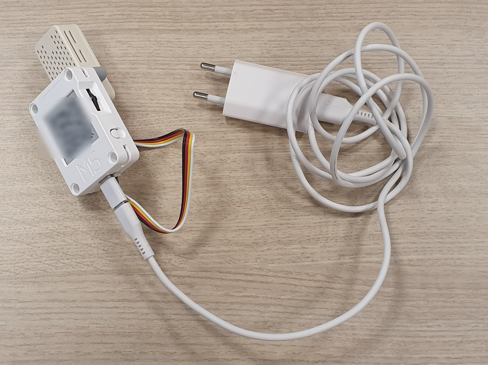

# Living room module

# About the device

Every 10 minutes, the living room module collects information about indoor temperature, CO₂-concentration, air humidity and the number of occupants present at home.
        
# Installation

Follow all steps below before you continue in the NeedForHeat app.
## 1. Attach the sensor to the main module

In the box you received, the sensor is not yet attached to the main module. Click the sensor with the black pins onto the gray bar at the back of the main module. Ensure that the air holes of the sensor are free.

## 2. Place at a suitable spot in the living room module

Find a suitable spot in the living room:

- out of the sun and brightly lit environments\*;
- away of draft;
- near the thermostat;
- in reach of your home Wi-Fi network;
- within reach of a free electrical outlet.

Place the living room module there.

\* This is related to accurate temperature measurements, but also to prevent smudges and streaks on the e-ink display. The e-ink screen of the living room module is sensitive to sunlight and bright daylight, which can cause light or dark spots. If you experience these spots on the screen, please refer to the [FAQ](../../faq/) to learn how to resolve them.
## 3. Plug in the power cord.

Plug the power cord into the power outlet.

## 4. Connect the device with your home Wi-Fi.

Continue in the NeedForHeat app to connect the device to your home Wi-Fi network.